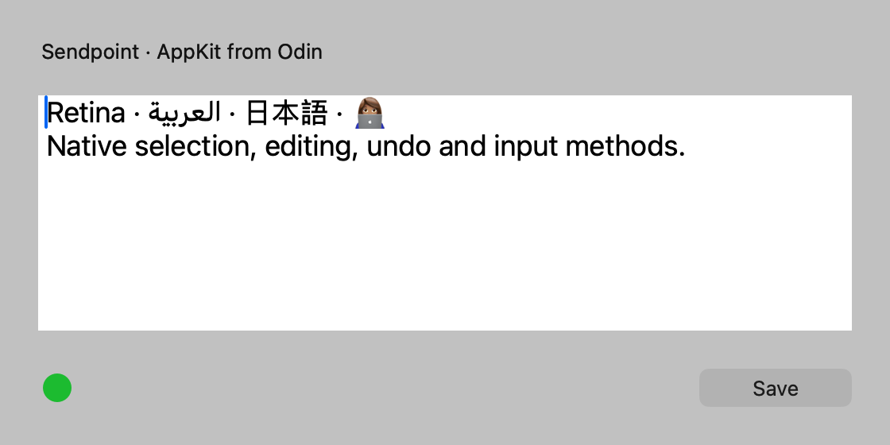
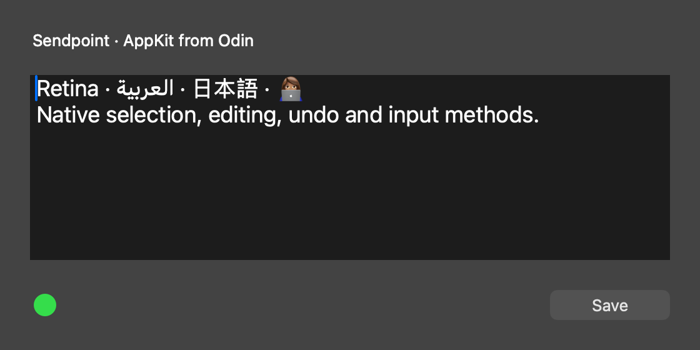

# Sendpoint's UI in Odin: native AppKit, surface by surface

Research for [#49](https://github.com/saiashirwad/sendpoint/issues/49), within [map #35](https://github.com/saiashirwad/sendpoint/issues/35). Updated 2026-09-30.

## Decision

**Build the UI from real AppKit controls, driven directly from Odin. No Swift or Objective-C source is required by the UI feasibility spike.** Use `NSWindow`/`NSPanel` for surfaces, `NSTextView` for notes, `NSTextField`/`NSSearchField` for fields, table/stack views for composition, `NSVisualEffectView` for materials, and small custom drawing views/layers for the voice ornament. Do not rebuild text editing, widgets or accessibility on a GPU canvas.

The user changed the scope during this research: Sendpoint is now a ground-up Odin rewrite, not a TypeScript/web-shell decision. This document supersedes the ticket's original webview-versus-GPU framing. The older map Notes/decisions are historical context, not the requirements followed here. Only the requested decision entry is added to that shared map; this ticket does not rewrite other sessions' decisions.

**Confidence:** direct AppKit access, runtime subclassing, native text controls, target/action, text delegates, synthetic composition, accessibility roles, light/dark snapshots and Core Text fallback are demonstrated. Full cross-app non-activation, actual IME candidate interaction, VoiceOver navigation, all six complete surfaces, production packaging and latency/idle-resource targets remain unverified. The prototype actually became active during its launch/show sequence; it is not evidence that a non-activating capture panel preserves the front application's focus.

## 1. What Odin already gives us—and what it does not

The installed compiler is `dev-2026-09:a2fb372b7` ([full source revision](https://github.com/odin-lang/Odin/tree/a2fb372b76e81ef31fbbc8a2cf2b4fdf5ac6c924)); tests ran on arm64 macOS 27.0, build 26A428. This is one development compiler/OS pairing, not a minimum-OS compatibility certification.

An important naming trap: **`core:sys/darwin/Foundation` already includes some AppKit**, not just Foundation. Its `objc.odin` links Foundation and, on macOS, Cocoa. It contains `NSApplication`, `NSWindow`, a minimal `NSPanel`, `NSEvent`, `NSMenu`, `NSScreen`, pasteboard, undo, timer and notification bindings. `NSView`/`NSResponder` live in `NSWindow.odin`. Conversely, `vendor:darwin` is not an all-purpose AppKit kit: at this revision its directories are CoreVideo, Foundation, Metal, MetalKit and QuartzCore. [O1][O2]

The missing part is **binding breadth and a safe application-level wrapper**, not a missing ability to call AppKit. In the inspected core package there are no complete text-view, text-field, button, table-view, Auto Layout or visual-effect wrappers. These can be introduced incrementally:

```odin
@(objc_class="NSTextView")
TextView :: struct {using _: NS.View}

text := intrinsics.objc_send(^TextView, NS.alloc(TextView),
    "initWithFrame:", NS.Rect{{0, 0}, {490, 148}})
intrinsics.objc_send(nil, text, "setRichText:", bool(false))
```

This is an Objective-C message to the actual system object, not an emulated widget. Foundation's own `NSObject.odin` and MetalKit's `MTKView` bindings use the same `intrinsics.objc_send` mechanism. The compiler needs explicit argument/return types; a misspelled selector or wrong signature is still our bug. Build typed wrappers once, rather than scattering raw selectors throughout the UI. [O1][O3][P1]

### Subclasses, callbacks and ownership

- The runtime bindings expose `objc_allocateClassPair`, `class_addMethod`, protocol registration and instance creation. The spike registers an `NSPanel` subclass (`canBecomeKeyWindow`, `canBecomeMainWindow`), an `NSView` subclass (`drawRect:`), and a target/delegate object entirely in Odin. Its button calls back into Odin; editing produces `textDidChange:`. [O1][P1]
- **A discovered trap:** a static `@(objc_class="MyRuntimeClass")` type reference was nil when used for a class registered later at runtime. Instantiating the newly registered class through the runtime, then sending its initializer, worked. Keep static type references for Apple's pre-existing classes; use the supplied subclass helpers or an explicitly late-bound instance factory for ours. This is an observation on this compiler, not a claim about every future Odin release. [P1][O4]
- Objective-C callbacks must use the C calling convention and correct ABI/type encodings, including structure arguments (`NSRect`) and the platform's `BOOL`. Our arm64 probe uses `B` for boolean method returns. Restore a valid Odin context before calling context-dependent Odin code from a callback. The sample uses the default context; production should recover the owning application's context and stable state pointer. [O4][P1]
- No ARC is inserted for us. Own retained native objects, delegates, observers and timers explicitly. Do not keep a pointer into a resizable Odin array or short-lived arena as a target's owner. Native controls retaining views does not mean they retain their delegates or targets. Clear callbacks/delegates before freeing their owner. AppKit work belongs on the main thread, using the AppKit event loop, not a continuously redrawing game loop. [O1][O4][A1][P1]
- Blocks are not an automatic reason to introduce Swift. Core has `NSBlock.odin`, with local/global and one-parameter helpers. But those helpers are not arbitrary closure marshalling: review return types, copy/dispose behavior and captured data lifetime for each API, especially event monitors and asynchronous completion handlers. Prefer target/action, delegates, selector timers and explicit Core Animation objects where they fit. The shipped helper's global-block release is a no-op at the runtime level; do not assume a normal release frees its Odin allocation. [O5]
- UI feasibility says nothing about the entire rewrite being Swift-free. Parakeet/FluidAudio and other subsystem boundaries belong to their own tickets. This spike establishes that **the UI itself** does not require Swift, a C/Objective-C shim, a nib, or SwiftUI. [P1]

## 2. Existing surfaces → AppKit construction plan

The source baseline inspected is Sendpoint commit [`3288cbac`](https://github.com/saiashirwad/sendpoint/tree/3288cbacb3872f65845636e843319adc203b074c). The following is a proposed ground-up implementation preserving behavior, not a recommendation to retain Swift code. Dimensions and behavior in the “current” column come from those files. Native widget choices are recommendations based on AppKit's text/window/event model. [A1–A5]

| Surface | What the current app actually does | Build in Odin/AppKit | Main work/risk |
|---|---|---|---|
| **Capture pill / typed capture card** | `CaptureView` is a multiline note editor with destination/tether/status footer; it is **not merely a small pill**. `CaptureWindows` uses a titled, resizable floating editor panel, forced dark, placed near captured text or the mouse; minimum width 320. | `NSPanel` + content `NSView`/`NSStackView`; `NSScrollView` containing a plain `NSTextView`; footer `NSButton`/pop-up destination control, truncating label and `NSProgressIndicator`. Rounded backdrop/border via layer or `drawRect:`. Preserve opaque/alpha styling unless deliberately choosing a material. | Selection-screen coordinate conversion, clamping to visible screen, focus after opening destination picker, frozen/saving/error controls, per-session undo. Source: [CaptureWindows](../../Sources/Sendpoint/Capture/CaptureWindows.swift), [CaptureView](../../Sources/Sendpoint/Capture/CaptureView.swift), [NoteEditor](../../Sources/Sendpoint/Capture/NoteEditor.swift). |
| **Voice capsule and optional transcript card** | Borderless **non-activating** floating panel. It is precreated and shown using `orderFrontRegardless`, not `presentActivated`. A 32pt capsule or 420pt-wide transcript card sits at the bottom of the mouse's screen; 680pt panel width includes layout/shadow space. No OS window shadow; current drawing supplies it. Destination picker can open during voice capture. Animations stop when hidden. | Separate persistent `NSPanel`, initialized with the non-activating style; native destination `NSButton`, status label and transcript labels/read-only `NSTextView`. A small `NSView` or `CAShapeLayer` group draws the meter/orb; do not write a whole renderer for it. Use a child non-activating panel for the destination list if an ordinary popover changes focus undesirably. | Preserve front-app selection, Escape handling while another process owns keyboard focus, never steal focus just to redraw transcript, coalesce transcript/meter updates, stop every timer/animation while hidden. [CaptureWindows](../../Sources/Sendpoint/Capture/CaptureWindows.swift), [VoiceCaptureView](../../Sources/Sendpoint/Voice/VoiceCaptureView.swift), [destination panel](../../Sources/Sendpoint/Capture/CaptureDestinationPanel.swift). |
| **Stack palette** | 680×520 resizable panel (minimum 560×460), search header, stack strip, note list/inline editing, footer, errors and overlays. Although its style contains `.nonactivatingPanel`, its current `present()` calls **`presentActivated()`**, which explicitly activates the app. Frame is saved; interactions affect close-on-resign behavior. | A real panel with `NSSearchField`, a horizontal stack/segmented strip, view-based `NSTableView` in `NSScrollView`, native row controls, an `NSTextView` for the active multiline edit, and header/footer stack views. Search/choose/move overlays can be child views or attached panels. Use stable note IDs in the adapter, not row indices as domain identity. | Dynamic row heights, focus/search/edit transitions, scrolling the moved/inserted note into view, distinguishing row selection from text selection, destructive-key routing, modal/unfinished edits. [window](../../Sources/Sendpoint/Palette/StackPaletteWindow.swift), [view](../../Sources/Sendpoint/Palette/StackPaletteView.swift), [rows](../../Sources/Sendpoint/Palette/PaletteRows.swift), [note list](../../Sources/Sendpoint/Palette/NoteListView.swift). |
| **Latest-note editor** | Reuses editor-panel styling; 560×360, minimum 440×300. Escape dismisses, ⌘Return saves, close/save behavior goes through its controller. | Reuse the same native note-editor component with a separate owner/session; retained panel, summary/context labels and action footer. Explicit first-responder requests when presenting. | Unsaved changes and close guards, stale note/document context, cancellation during save, undo scoped to this edit—not the capture editor. [window](../../Sources/Sendpoint/Capture/LatestNoteEditorWindow.swift), [view](../../Sources/Sendpoint/Capture/LatestNoteEditorView.swift). |
| **Settings** | Normal titled/resizable 920×600 minimum window; unified toolbar, sidebar; Capture, Preview, Stacks, Templates, Pasting, System. Template changes can block closing; permission/model watching runs only while appropriate. | `NSWindow`, native sidebar list/buttons, `NSStackView`/`NSGridView` form pages, `NSScrollView`, checkboxes/switches, sliders, pop-up buttons, progress indicators. `NSTextView` for template bodies, table/list for templates. `NSAlert` sheets for unsaved decisions. Rebuild shortcut recording as a focused control, not a text field that inadvertently accepts the shortcut as text. | Largest binding/widget breadth, target/action wiring, validation and enabled state, keyboard recording, template editor transaction/undo, live preview ownership. [window](../../Sources/Sendpoint/Settings/SettingsWindowController.swift), [tabs](../../Sources/Sendpoint/Settings/SettingsView.swift), the six `Settings*Pane.swift` files. |
| **Setup** | Borderless key-capable 500×352 panel; Accessibility → microphone → model download/retry → guided tour. Polls at 700ms while shown and deliberately reactivates on step changes. | Borderless `NSPanel` with native labels, buttons and progress indicator in a stack layout; small custom hero decoration. One main-thread selector timer or notification adapter updates an Odin projection. Preserve explicit activate-on-stage-change policy only if still wanted. | Permission requests vs permission **UI**, opening System Settings and returning, model progress/cancel/retry, polling teardown and duplicate completion prevention. [window](../../Sources/Sendpoint/Settings/SetupWindowController.swift), [view](../../Sources/Sendpoint/Settings/SetupView.swift), [tour](../../Sources/Sendpoint/Settings/SetupTour.swift). |

Ancillary surfaces must not disappear from the eventual rewrite inventory: menu bar/menu actions, app-wide stack switcher, destination chooser, template dialogs and confirmation sheets. They can use `NSStatusItem`/`NSMenu`, list panels and `NSAlert`, respectively. This research does not claim to have ported their workflows.

### Layout strategy

Use native Auto Layout/`NSStackView` for forms and resizing, and a small pure layout function returning point-space rectangles for the tightly specified capsule/card. Keep layout calculations outside event callbacks and native view mutation. Build persistent controls once; project state changes into properties rather than recreating the entire hierarchy on each transcript/meter update. This is a design recommendation: it reduces opportunities to lose first responder, selection, marked text and delegate identity. The probe uses fixed frames for brevity; it does **not** validate a production constraint system or palette row virtualization. [A3][A4][P1]

## 3. Text editing: mostly provided, but integration still matters

**Use `NSTextView`, not a glyph atlas plus a home-grown editor.** Apple describes it as the general-purpose interface to the text system and explicitly supports selection, wrapping, copy/paste, delegates and spelling. `NSTextField` is appropriate for short single-line fields and uses a window-shared field editor; it is not the same lifecycle as a permanently owned `NSTextView`. [A3]

The existing `NoteEditor.swift` already shows the important specification: plain text, no imported graphics, undo, no background, width-tracking text container, vertical resize/scrolling, zero fragment padding, font/paragraph styles, placeholder only when empty **and not composing**, and no model-to-view `setString` while `hasMarkedText` is true. Preserve these semantics in Odin. Do not overwrite the text after each `textDidChange:` callback; update the model from the native edit and avoid sending the same value back. An external update should preserve/clamp selection and have an explicit undo policy. [local NoteEditor][A3]

**UTF-8 is not `NSRange`.** Odin strings are UTF-8; NSString/text-system range offsets are UTF-16 code units. Never pass an Odin byte index directly into `selectedRange:` or a replacement range. Keep edit ranges in the native representation at the UI boundary, and test emoji sequences, combining accents and right-to-left text. `👩🏽‍💻` being rendered as one glyph does not mean it occupies one UTF-16 code unit. [O6][A6][P2]

IME input is already implemented by the native text view, including marked text and input-manager cooperation. Do not intercept raw `keyDown:` characters and insert them yourself. Let Escape/Return/arrows reach composition while marked text is active; only after the text system declines a command should ordinary palette navigation/dismissal take over. Production must test Japanese/Chinese composition, candidate positioning, accents/dead keys, emoji entry, bidirectional selection and undo. Our direct `setMarkedText:`/`insertText:` test verifies the ABI and lifecycle flag, **not actual input-method candidate windows**. [A4][A6][P1]

**Retina/fallback:** normal AppKit text uses system text rendering; we do not need atlas DPI management. Custom Core Graphics drawing should use view coordinates in points and respond to backing-scale changes for any manually cached image/layer contents. The probe's view snapshot is 1120×560 for a 560×280pt view at scale 2. The standalone Core Text probe shapes Arabic with GeezaPro, Japanese with PingFangSC-Regular and the emoji with AppleColorEmoji; this demonstrates fallback access, not a comprehensive Unicode/font-quality guarantee. Do not force those observed fallback font names into production. [A3][A7][P1][P2]

## 4. Focus and keys are the highest-risk UI integration

There are three distinct concepts: app activation, the key window, and that window's first responder. A non-activating panel is not automatically non-key, and `orderFrontRegardless` is not a request to start editing. Apple's panel model supports key-only-if-needed; text views can need the panel to become key. Distinguish a passive voice HUD from an explicitly focused editor. [A1][A2][A4]

Recommended policies:

1. **Voice:** keep the panel non-activating for its whole lifetime. Show without activating or making it key; retain the originating app/selection context separately. The destination chooser must not accidentally turn this into the editor focus policy. Keep Escape in the global-hotkey layer while the front app receives typing; a local AppKit monitor cannot see arbitrary other-process events. This matches the current split in `CaptureWindows.swift` rather than treating every overlay identically.
2. **Capture/latest editor:** explicitly activate and make key, then `makeFirstResponder(textView)`. The current application already does this. Restore focus deliberately on dismissal where appropriate, with stale-front-app checks; do not blindly reactivate an app the user has since left.
3. **Palette:** preserve today's explicit activation unless the product intentionally changes it. First responder begins in search; inline editing owns arrows/selection/copy. A selected substring must keep ⌘C behavior rather than triggering whole-note export. Current palette key routing checks `NSTextView.selectedRange().length` for exactly this distinction.
4. **Settings/setup:** normal activated windows/panels with a correct key-view loop and modal sheet handling. Do not close a parent when a child sheet takes focus.

Use native edit-menu actions (`cut:`, `copy:`, `paste:`, `selectAll:`, `undo:`, `redo:`) routed through the responder chain, plus explicit save/cancel commands. Native text controls supply the operations, but an otherwise empty hand-built application still needs menus/key-equivalent wiring. Prefer text delegates and responder commands for text-related keys. If a monitor is required, scope it to the surface, return unhandled events, and remove it on teardown. Do not consume every Return/Escape globally while the user is composing. [A4]

**Measured caveat:** the native probe reported `app active=false` before showing, then `panel key=true; app active=true` after showing/pumping/making key. It did not explicitly call `activate`, but launch timing and the probe's focus sequence are not isolated. Therefore the test proves a working editor first responder, not inactive-app keyboard focus or focus preservation. A bundled background app launched before the test, with another app kept frontmost and a passive-show-only path, is the next focused experiment. Do not “fix” this with private WindowServer APIs or by toggling the non-activating style at runtime. [P1]

## 5. Accessibility, materials, motion and theme

### Accessibility really does come with native controls

Apple says standard AppKit controls have default accessibility values, actions and notifications, and a button's title supplies its label. The language used to instantiate the control does not change that implementation. In the spike the native text view reports `AXTextArea`, and the unignored button descendant reports `AXButton`; a direct query to the container button initially reported `AXUnknown`, so querying the actual accessible element matters. [A5][P1]

That is a strong reason to choose AppKit, **not a claim that the finished app needs no accessibility work**. Supply useful destination/status labels, relationships, grouping, traversal order, custom save/discard actions, selected row state and restrained live status announcements. Pure `drawRect:` decorations have no automatic semantic value: mark an ornamental meter ignored, and expose “Listening / processing / error” as a native label/status element. If a drawn object is interactive, use a real button or implement its accessibility role/actions/notifications. Keyboard-only and VoiceOver testing remain required; no VoiceOver interaction was run here. [A5][A8]

### Vibrancy/blur

Use **public `NSVisualEffectView`**, with a semantic material such as popover, sidebar or HUD window; choose behind-window versus within-window blending deliberately. AppKit adapts the material to appearance/state. Its `maskImage` can shape the material and influence a content-view window shadow, but **does not also mask its subviews**—clip/lay out the contents separately. Set window opacity/background consistently. The SDK warns that not every material supports both blending modes. [A9]

The current capture/voice views draw translucent dark fills, not necessarily true vibrancy. Preserve the intended design rather than replacing every backdrop with blur. Use system materials where native feel is wanted, and test Reduce Transparency and increased contrast. Our cached view images prove construction and theme behavior; they do not demonstrate the WindowServer's live blur of another application's contents. [local CaptureView/VoiceCaptureView][P1]

### Animation

Use AppKit view animation/`NSAnimationContext` where bound, or explicit Core Animation (`CABasicAnimation`/`CASpringAnimation`, layer opacity/transform/path) for capsule appearance and the meter. Core Animation already uses hardware compositing; choosing AppKit does not mean choosing CPU-only software animation. Do not add a continuously running raylib/Sokol loop merely to draw a 22pt orb. [A10][O2]

Own the meter/display timer in the voice surface controller; coalesce audio updates onto the main thread, animate only when visible, cancel/remove animation at teardown and honor Reduce Motion. Persist the model value separately from animation presentation values. The current `VoiceCaptureView` already ties animation to visibility. These are implementation requirements, not benchmark results; this spike draws only a static green ornament.

### Theming

Default to semantic `NSColor` values, system fonts and inherited `effectiveAppearance`. For the intentionally dark capture surface set `NSAppearance` on that hierarchy; let ordinary settings/palette follow the user's theme. Re-resolve any cached `CGColor` on `viewDidChangeEffectiveAppearance` rather than freezing a once-resolved color. Test high contrast and changed accent colors. Both light and dark native-control snapshots were produced, but a live system-theme-change sequence was not tested. [A9][A11][P1]

## 6. Working spikes and exact limits

### Native controls: `odin-ui/appkit.odin`

From the repository root:

```sh
odin run docs/research/odin-ui/appkit.odin -file
odin run docs/research/odin-ui/appkit.odin -file -- dark
```

Each run creates a short-lived native panel, exercises it, saves a view-only PNG and exits. It does not read/write Sendpoint settings, request TCC permissions, use the user's clipboard, or modify app code. It can briefly appear and take focus. Do not use its finite event-pumping loop or global callback counters as production application architecture.

Observed in both modes (full [captured output](odin-ui/results.txt)):

```text
Before show: app active=false
Panel key=true; app active=true; backingScale=2.0
AX roles: text=AXTextArea button=AXButton; callbacks: save=1 change=1
PASS: native controls, subclass drawRect, target/action, text delegate,
      selection, synthetic marked text, snapshot, explicit teardown
```

The executable's direct dependencies from `otool -L` are libobjc, AppKit, Foundation, Cocoa and libSystem. There is no direct Swift runtime, WebKit or third-party GUI dependency. This does not claim Apple's framework internals contain no Swift. The uncommitted webview experiment from before the scope change was removed; it is not part of the deliverable.





These are **mechanism demonstrations, not proposed final Sendpoint styling**, and are cached content-view renderings rather than desktop screenshots. We restore the same text fixture after the synthetic composition test so images can be compared. Default bidirectional layout may depend on text/input context; validate that deliberately in the real note editor.

### Core Text: `odin-ui/text.odin`

```sh
odin run docs/research/odin-ui/text.odin -file
```

Calls Core Text's C ABI from Odin, using an attributed string with default attributes:

| Sample | Observed fallback/font | Glyph count | Width (points) |
|---|---|---:|---:|
| Sendpoint | Helvetica | 9 | 54.05 |
| العربية | GeezaPro | 7 | 27.27 |
| 日本語 | PingFangSC-Regular | 3 | 36.00 |
| 👩🏽‍💻 | AppleColorEmoji | 1 | 16.00 |
| e + combining acute | Helvetica | 1 | 6.67 |

This proves access to native shaping/fallback and correctly marshalled calls. It is not a custom text renderer, a color-glyph rasterization benchmark, or a reason to replace `NSTextView`.

### Still not confirmed

- Minimum supported macOS/Intel ABI, signing/notarization and a long-lived bundled application's lifecycle.
- True passive non-activating presentation, fullscreen Spaces/multiple displays, click-to-focus destination chooser and focus restoration across apps.
- Actual physical keyboard/IME/dead-key behavior, candidate geometry, menu shortcuts, paste/drag, undo grouping and VoiceOver interaction.
- Full palette data-source/delegate implementation, dynamic row reuse, Auto Layout constraints, resize and scroll restoration.
- Visual blur behind windows, shadow masking, live appearance/accessibility preference changes, animation frame pacing.
- Production allocation/leak checks, repeated teardown, stale callbacks, startup/show latency, peak/steady RSS or hidden idle CPU. No comparative resource claims are made from these probes.

No `./check.sh` or `./ship.sh` was run: this is research-only with no app code change, per the brief.

## 7. Implementation order and fallback boundary

Recommended order, not an effort estimate:

1. **Native boundary package:** pin Odin; typed wrappers for application, windows, controls, text, layout, notifications, AX, animation; callback/object ownership harness; test required ABI shapes. Build a normal `.app` with accessory activation and menus.
2. **Editor + passive voice shell:** reproduce the two distinct focus policies, real IME editing, global Escape, destination chooser and show/hide teardown. This is the hard gate, before reproducing all visual polish.
3. **Palette:** stable-ID adapter + native table/inline text editing + keyboard precedence + scroll targeting. Keep reducers/data transformations in pure Odin, with effect handles and generation/context checks owned by controllers.
4. **Settings/latest-note/setup:** shared native components, per-editor undo, modal close protection, appearance/material polish and permission/download lifecycle projections.
5. **Automated regression suite:** pure reducer tests plus native boundary tests; view-only light/dark snapshots for every surface/state; separate manual keyboard/IME/VoiceOver/Spaces checklist; measure cold/warm display and hidden idle cost on the target machine.

**Clay/Metal is a fallback only if a specific AppKit requirement proves unworkable. None has yet.** It would not solve AppKit focus/TCC/native integration and would add custom control, text-input and accessibility work. The Clay project describes itself as a layout engine that emits render commands and requires a text measurement function; it does not supply the native text system. Odin's Metal/MetalKit bindings establish graphics access, not an editor/widget toolkit. [F1][O3]

A concrete comparable Odin/Clay project, [`joekerenski/odin-ui-v2`](https://github.com/joekerenski/odin-ui-v2), has a graph/showcase and documents its own macOS input, Retina, frame-pacing and theme patches; its README says its atlas is limited to ASCII/Latin-1/common symbols and missing characters become `?`. That is evidence of real integration work, **not** evidence that polished multilingual Sendpoint editing is already available in that stack. The search also found [`Platin21/odin-cocoa-foundation`](https://github.com/Platin21/odin-cocoa-foundation), whose README calls it WIP with CFString/Array implemented; it is not a mature full AppKit application framework. No production-quality AppKit-from-Odin app comparable to all of Sendpoint was confirmed in this search. Our direct native probe is stronger evidence of the narrow UI boundary than those repository names. [F2][F3]

## Sources

Primary source links below distinguish library/API facts from our implementation recommendations. Older Apple guides are used for established architecture; the installed SDK headers were also checked for the present declarations.

- **O1:** Odin [Foundation directory](https://github.com/odin-lang/Odin/tree/a2fb372b76e81ef31fbbc8a2cf2b4fdf5ac6c924/core/sys/darwin/Foundation), especially [objc runtime](https://github.com/odin-lang/Odin/blob/a2fb372b76e81ef31fbbc8a2cf2b4fdf5ac6c924/core/sys/darwin/Foundation/objc.odin), [NSObject](https://github.com/odin-lang/Odin/blob/a2fb372b76e81ef31fbbc8a2cf2b4fdf5ac6c924/core/sys/darwin/Foundation/NSObject.odin), [NSWindow](https://github.com/odin-lang/Odin/blob/a2fb372b76e81ef31fbbc8a2cf2b4fdf5ac6c924/core/sys/darwin/Foundation/NSWindow.odin) and [NSPanel](https://github.com/odin-lang/Odin/blob/a2fb372b76e81ef31fbbc8a2cf2b4fdf5ac6c924/core/sys/darwin/Foundation/NSPanel.odin).
- **O2:** Odin [vendor/darwin](https://github.com/odin-lang/Odin/tree/a2fb372b76e81ef31fbbc8a2cf2b4fdf5ac6c924/vendor/darwin).
- **O3:** Odin [MetalKit bindings](https://github.com/odin-lang/Odin/blob/a2fb372b76e81ef31fbbc8a2cf2b4fdf5ac6c924/vendor/darwin/MetalKit/MetalKit.odin), showing typed message sends and native delegate callbacks.
- **O4:** Odin [subclass/context helpers](https://github.com/odin-lang/Odin/blob/a2fb372b76e81ef31fbbc8a2cf2b4fdf5ac6c924/core/sys/darwin/Foundation/objc_helper.odin).
- **O5:** Odin [NSBlock implementation](https://github.com/odin-lang/Odin/blob/a2fb372b76e81ef31fbbc8a2cf2b4fdf5ac6c924/core/sys/darwin/Foundation/NSBlock.odin).
- **O6:** Odin [strings and conversions](https://odin-lang.org/docs/overview/#string-type).
- **A1:** Apple [How Panels Work](https://developer.apple.com/library/archive/documentation/Cocoa/Conceptual/WinPanel/Concepts/UsingPanels.html); [Thread Safety Summary](https://developer.apple.com/library/archive/documentation/Cocoa/Conceptual/Multithreading/ThreadSafetySummary/ThreadSafetySummary.html).
- **A2:** Apple [nonactivatingPanel](https://developer.apple.com/documentation/appkit/nswindow/stylemask-swift.struct/nonactivatingpanel), [becomesKeyOnlyIfNeeded](https://developer.apple.com/documentation/appkit/nspanel/becomeskeyonlyifneeded), [needsPanelToBecomeKey](https://developer.apple.com/documentation/appkit/nsview/needspaneltobecomekey); checked against SDK `NSPanel.h`/`NSView.h`.
- **A3:** Apple [Cocoa Text System Organization](https://developer.apple.com/library/archive/documentation/TextFonts/Conceptual/CocoaTextArchitecture/TextSystemArchitecture/ArchitectureOverview.html), including field-editor sharing, text objects and scroll views.
- **A4:** Apple [Handling Key Events](https://developer.apple.com/library/archive/documentation/Cocoa/Conceptual/EventOverview/HandlingKeyEvents/HandlingKeyEvents.html), input management, responder chain, key equivalents and key-view loops.
- **A5:** Apple [Enhancing Accessibility of Standard AppKit Controls](https://developer.apple.com/library/archive/documentation/Accessibility/Conceptual/AccessibilityMacOSX/EnhancingtheAccessibilityofStandardAppKitControls.html).
- **A6:** Apple [NSTextInputClient](https://developer.apple.com/documentation/appkit/nstextinputclient), checked against SDK `NSTextInputClient.h`; [NSString](https://developer.apple.com/documentation/foundation/nsstring).
- **A7:** Apple [High Resolution Guidelines](https://developer.apple.com/library/archive/documentation/GraphicsAnimation/Conceptual/HighResolutionOSX/Introduction/Introduction.html), [Core Text](https://developer.apple.com/documentation/coretext).
- **A8:** Apple [Implementing Accessibility for Custom Controls](https://developer.apple.com/library/archive/documentation/Accessibility/Conceptual/AccessibilityMacOSX/ImplementingAccessibilityforCustomControls.html).
- **A9:** Apple [NSVisualEffectView](https://developer.apple.com/documentation/appkit/nsvisualeffectview); inspected SDK `NSVisualEffectView.h` (material, blending, state and mask documentation).
- **A10:** Apple [Core Animation overview](https://developer.apple.com/library/archive/documentation/Cocoa/Conceptual/CoreAnimation_guide/Introduction/Introduction.html).
- **A11:** Apple [viewDidChangeEffectiveAppearance](https://developer.apple.com/documentation/appkit/nsview/viewdidchangeeffectiveappearance()), also declared in the inspected SDK `NSView.h`.
- **P1:** Reproducible [native spike](odin-ui/appkit.odin) and its two images above; locally executed, not inferred from documentation.
- **P2:** Reproducible [Core Text spike](odin-ui/text.odin); locally executed.
- **F1:** Clay [README at inspected revision e6cc369](https://github.com/nicbarker/clay/blob/e6cc36941ab2af5d81107617039d6f527a1c660b/README.md), layout/renderer/text measurement responsibilities and Odin bindings.
- **F2:** [odin-ui-v2 README](https://github.com/joekerenski/odin-ui-v2/blob/main/README.md), inspected 2026-09-30; upstream observations are not our measurements.
- **F3:** [odin-cocoa-foundation README](https://github.com/Platin21/odin-cocoa-foundation), inspected 2026-09-30.

SDK headers were read under `$(xcrun --show-sdk-path)/System/Library/Frameworks/AppKit.framework/Headers/`. These are local Apple primary sources, not vendored or copied into this repository.
